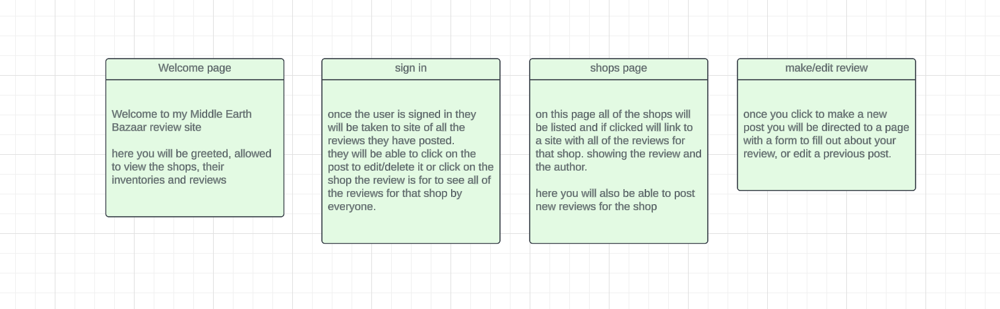

# Midddle-Earth-Bazaar
The Middle Earth Bazaar is a project I completed during the Software Engineering Bootcamp. It is obviously inpsired by the timeless creation of J.R.R. Tolkien. It is a place where fellow adventurers such as yourself can leave reviews of interesting Shoppes that this great land has to offer.

## Snapshots from the application:

## Getting started: 

 

 Wireframes, ERD's, & Route Tables 

## Technologies Used: 
  
  
  
  
  
  

## Attributions: 

https://images.fineartamerica.com/images/artworkimages/mediumlarge/3/the-shire-andrew-read.jpg
https://images.squarespace-cdn.com/content/v1/613ff93b8fa1470440856567/1634316914999-K8H2ZNWUM3A21WMA4MRU/Lord+of+the+Rings+Mirkwood+by+Alan+Lee.jpeg
https://qph.cf2.quoracdn.net/main-qimg-ac946944476662f7b6e3ab234b353fdd-lq
https://assets-global.website-files.com/65142042657ddc9d3dfc468e/651eb4d18f458f91812d38c0_PressRelease_Feature.jpg

## Next Steps:

&#9744; More CSS, change the styling more

&#9744; Check mobile compatibility

&#9744; Click on a user and see all of the reviews they have written